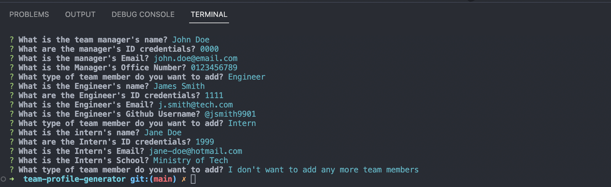
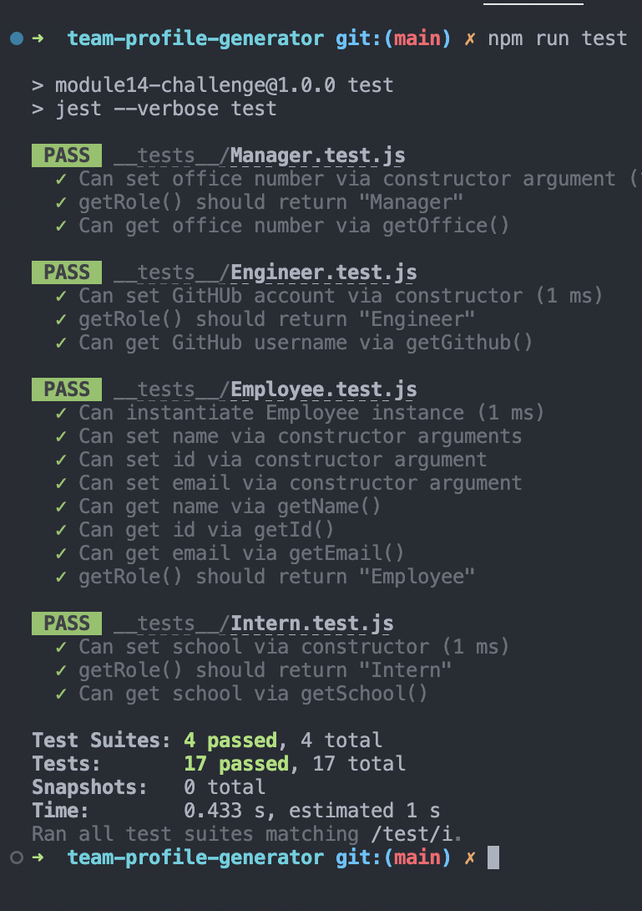
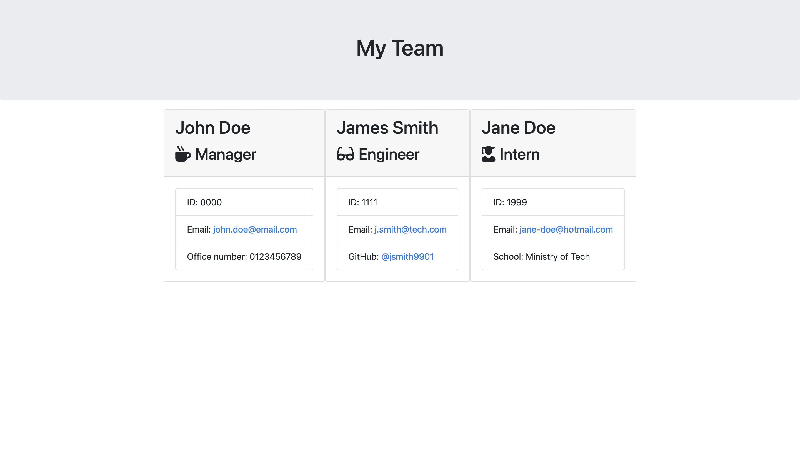

# team-profile-generator

## Description

The week 12 Bootcamp Challenge is a CLI application that uses Inquirer JS, OOP and Jest JS (for testing), to build a Team Profile Generator which renders an HTML page upon user input.

## Installation

You will need to have Node JS installed and will require the Inquirer and Jest JS npm packages installed as dependencies in order to utilise this application.

## Usage

Please enter the members of the Team using the CLI and the application will automatically generate the HTML output.

## Screenshots

## Credits

N/A

## Licence

NONE
